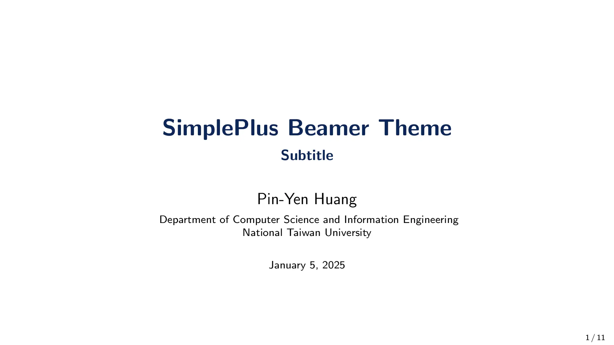
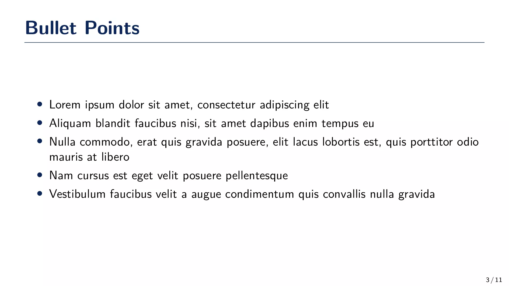
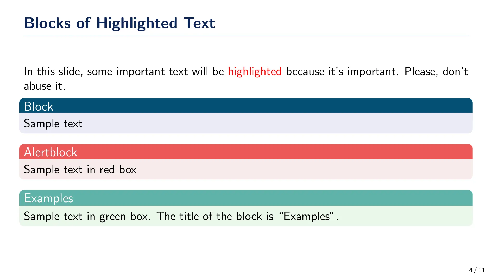
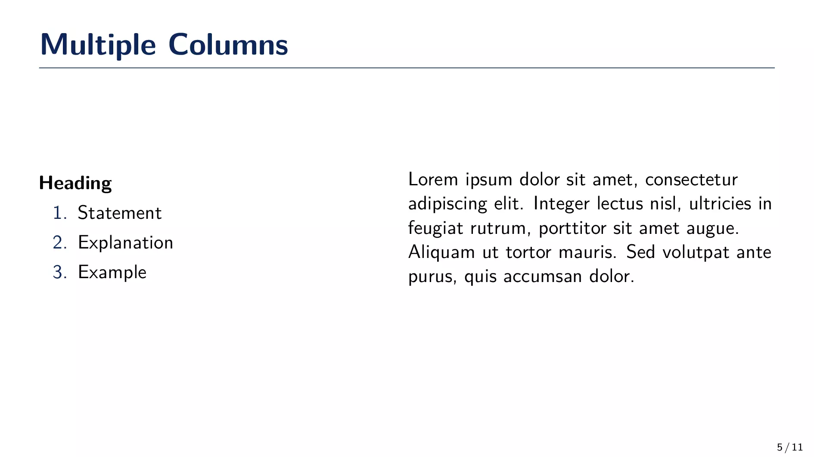
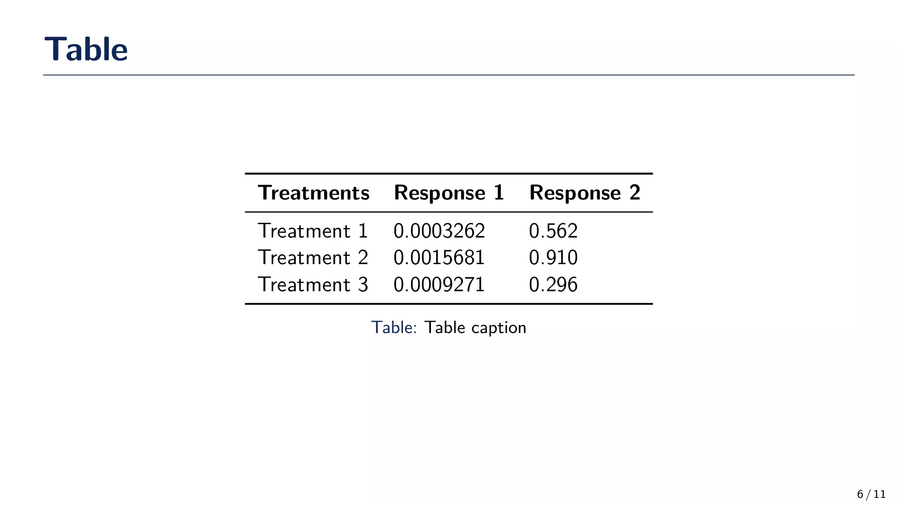
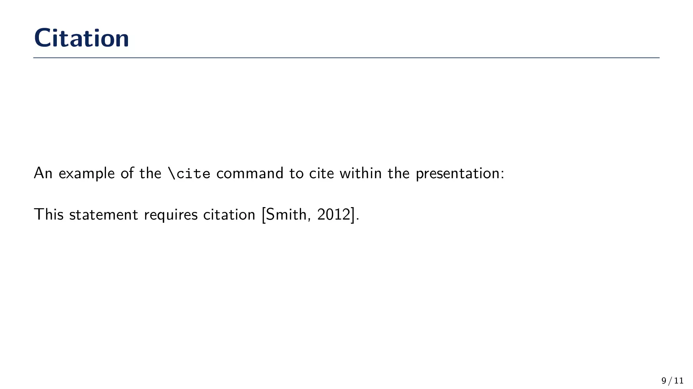

# 🍃 SimplePlus Beamer Theme

The **SimplePlus Beamer Theme** is a minimalist and elegant LaTeX template tailored for academic and scientific presentations. It has been modified from the [🫐SimpleDarkBlue](https://github.com/pm25/SimpleDarkBlue-BeamerTheme) Beamer Theme and focuses on simplicity and clarity in presentation design.

You can find the SimplePlus Beamer Theme on [Overleaf](https://www.overleaf.com/latex/templates/simpleplus-beamertheme/wfmfjhdcrdfx) and [CTAN](https://ctan.org/pkg/beamertheme-simpleplus). The Overleaf link provides an easy-to-use web-based LaTeX editor, while the CTAN link allows you to download the template files for use in your own LaTeX environment.

-   Overleaf: [https://www.overleaf.com/latex/templates/simpleplus-beamertheme/wfmfjhdcrdfx](https://www.overleaf.com/latex/templates/simpleplus-beamertheme/wfmfjhdcrdfx)
-   CTAN: [https://ctan.org/pkg/beamertheme-simpleplus](https://ctan.org/pkg/beamertheme-simpleplus)

## Preview

Below are some example slides created with the SimplePlus Beamer Theme:

## License

This project is released under the **Unlicense License**, granting you complete freedom to use, modify, and distribute the template. For more details, see the [LICENSE](./LICENSE) file.
